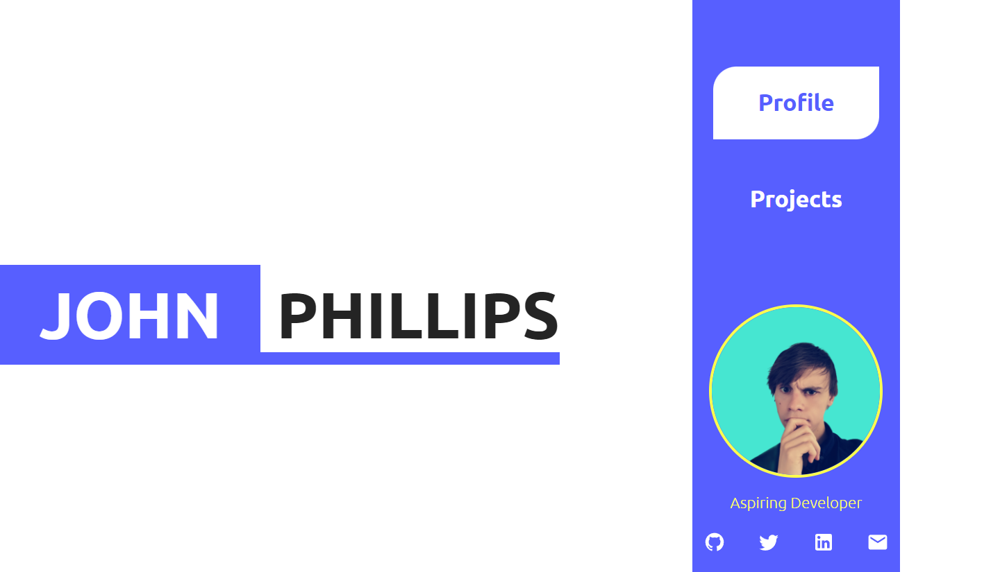

<h1>Personal Portfolio - Version 1</h1>
 This is a solution to the

[freeCodeCamp "Personal Portfolio Webpage" challenge.](https://www.freecodecamp.org/learn/responsive-web-design/responsive-web-design-projects/build-a-personal-portfolio-webpage).

freeCodeCamp is a non-profit organization that consists of an interactive learning web platform, an online community forum, chat rooms, online publications and local organizations that intend to make learning web development accessible to anyone.

<!-- REPLACE HREFS -->

<h2>Overview</h2>

 This was my first portfolio design and although it may not seem like much, it was a great accomplishment for myself. 
 
 Over the course of my journey I have struggled to create a portfolio that I am satisfied with.

This portfolio quickly got replaced, but despite this. I'm happy with the animation and overall result of the page!

